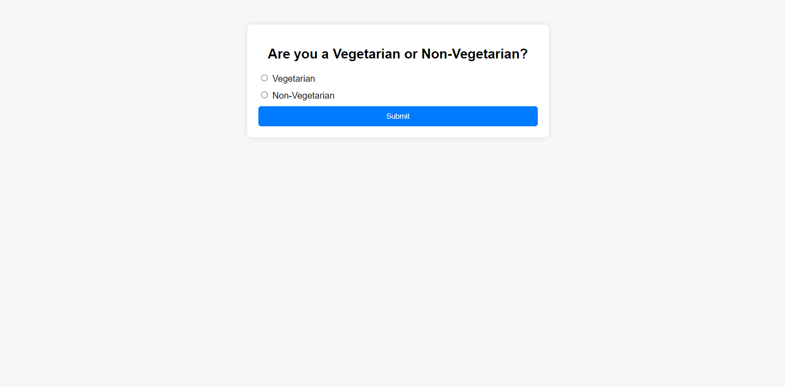
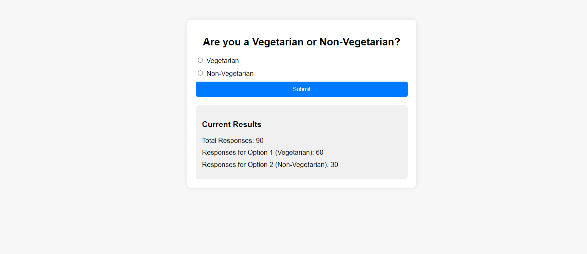

# Voting-System

Set Up Your Project Structure:
Tech Used: Javascript,NodeJs
Database: SQLlite

# 1.Create a new directory for your project.

Inside the project directory, create the following files:
server.js: This file will contain the Express.js server code.
index.html: This file will contain the HTML code for the voting form.
main.js: This file will contain the client-side JavaScript code.
style.css: This file will contain the CSS styles for your application.

# 2.Initialize a Node.js Project:

Open a terminal and navigate to your project directory.
Run npm init -y to initialize a new Node.js project with default settings.
Install the necessary dependencies:
css
Copy code
npm install express sqlite3 body-parser cors

# 3.Create the Express Server:

In the server.js file, set up an Express server.
Use sqlite3 to create a SQLite database for storing votes.
Define routes to handle submitting votes and fetching results.

# 4.Create the HTML Form:

In the index.html file, create a simple HTML form with radio buttons for voting options.
Include a button to submit the form.

# 5.Write Client-Side JavaScript:

In the main.js file, write JavaScript code to handle form submission and display results.
Use fetch() to send a POST request to the server when the form is submitted.
Use fetch() to send a GET request to the server to fetch voting results.
Update the HTML content to display the voting results.

# 6.Style Your Application:

In the style.css file, write CSS rules to style your voting form and results display.
Use CSS to make your application visually appealing and user-friendly.

# 7.Start the Express Server:

Run node server.js in the terminal to start your Express server.
Your server should now be running and listening for requests on a specified port.
Access Your Voting System:

Open a web browser and navigate to http://localhost:<port> (replace <port> with the port number your server is running on).
You should see your voting form displayed in the browser.
Cast some votes and verify that the results are displayed correctly.

